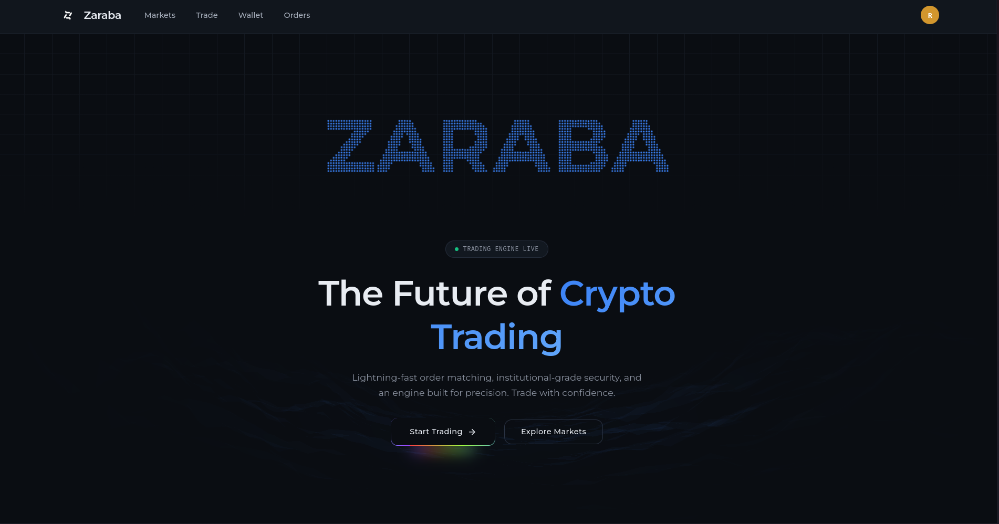
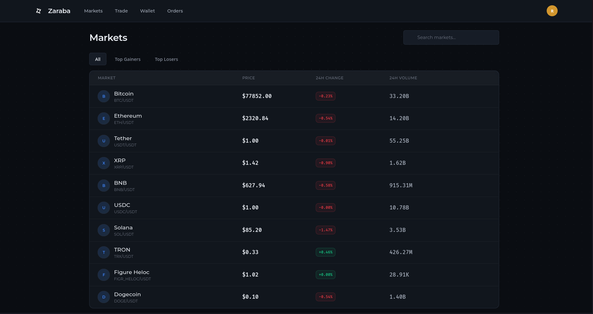
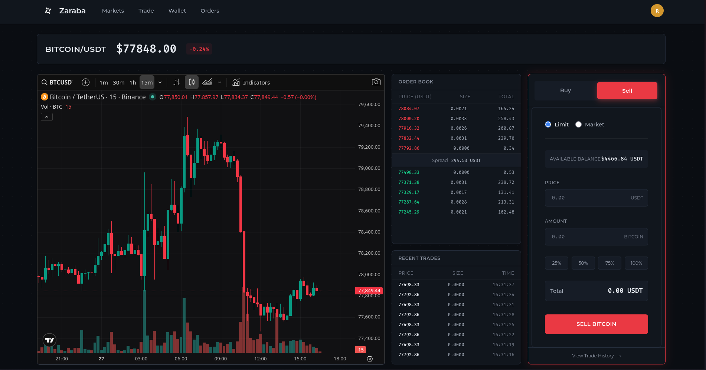
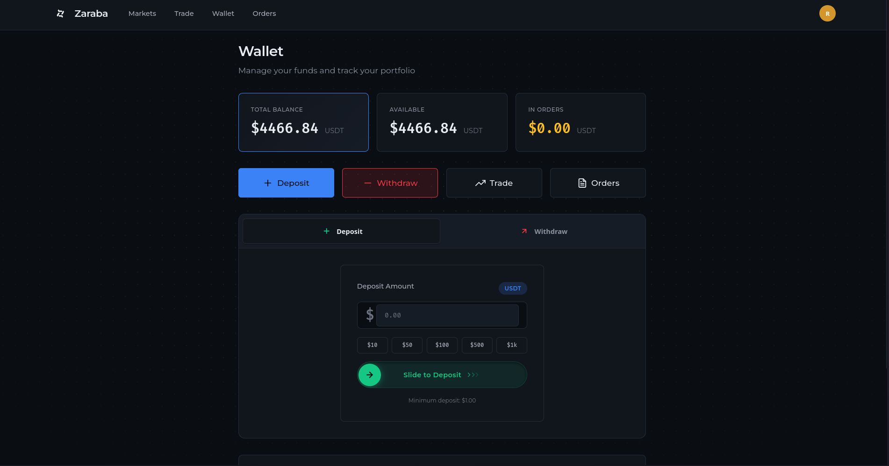

# Zaraba

[](https://wakatime.com/badge/user/48b7c6b6-47f6-43fd-b31a-738678b1cdeb/project/a5b663dc-49ae-4864-bc64-bf3164b21bc7)

Zaraba is a cryptocurrency exchange backend written in Go, built around an in-memory orderbook, an internal gRPC service layer, and a server-rendered UI.


## Screenshots

### Landing Page


### Markets


### Trade Interface


### Wallet


## What it includes

- In-memory matching engine for limit and market orders
- Integer-based price and quantity handling for financial precision
- HTTP app (Chi) with session auth and CSRF protection
- Internal gRPC exchange service in the same process
- Real-time market, orderbook, and trade streams via SSE
- PostgreSQL persistence for users, wallets, orders, and sessions
- Templ-based server-rendered frontend

## Architecture at a glance

- Single process starts both HTTP (`:8080` by default) and gRPC (`:50051` by default)
- HTTP handlers call the in-process exchange server
- Matching happens in memory (`internal/engine`)
- SSE brokers push updates to connected browser clients
- PostgreSQL stores user, wallet, order, and session data

## Tech stack

- Go 1.25+
- Chi router
- gRPC + Protocol Buffers
- PostgreSQL (`lib/pq`)
- SCS sessions (Postgres store)
- Templ for HTML rendering

## Project structure

```text
cmd/exchange      HTTP server, routes, middleware, handlers
cmd/simulator     Optional market-maker bot
internal/engine   Matching engine + precision helpers
internal/models   Database access (users, wallets, orders)
internal/service  gRPC server, SSE brokers, liquidity manager
proto/            Protobuf definitions
pb/               Generated protobuf Go code
ui/               Templ pages, partials, static assets
schema.sql        Wallet and order tables
```

## Quick start

### 1) Prerequisites

- Go 1.25+
- PostgreSQL

### 2) Environment variables

Required in normal use:

- `DATABASE_URL` (PostgreSQL DSN)
- `API_KEY` (CoinGecko API key)

Common local defaults:

- `CSRF_SECURE_COOKIE=false`
- `DISABLE_CSRF=true`
- `APP_ENV=development`

### 3) Database setup

Create these tables:

1. `users` table
2. `wallets` and `orders` tables from `schema.sql`
3. `sessions` table for SCS session storage

The full SQL is documented in `mydocs/DEPLOYMENT.md`.

### 4) Build and run

```bash
go build -o bin/exchange ./cmd/exchange/
go run ./cmd/exchange/ -addr :8080 -dsn "$DATABASE_URL"
```

Run tests:

```bash
go test -v ./...
```

Optional simulator:

```bash
go build -o bin/simulator ./cmd/simulator/
SIM_BASE_URL=http://localhost:8080 go run ./cmd/simulator/
```

## Runtime endpoints

Core routes:

- `GET /ping`
- `GET /markets`
- `GET /trade/{symbol}`
- `POST /trade/{symbol}/placemarketorder`
- `POST /trade/{symbol}/placelimitorder`
- `GET /user/wallet`

SSE routes:

- `GET /sse/markets`
- `GET /sse/orderbook`
- `GET /sse/trades`

gRPC service methods (`proto/exchange.proto`):

- `PlaceMarketOrder`
- `PlaceLimitOrder`
- `StreamOrderBook`

## Precision model

- Price scale: `1 USDT = 1,000,000` micro-units (`int64`)
- Quantity scale: `1 unit = 100,000,000` base units (`int64`)

All matching and notional calculations are integer-based in the engine.

## Development notes

- Edit `.templ` files, then run `templ generate`
- Edit `proto/*.proto`, then run `make proto`