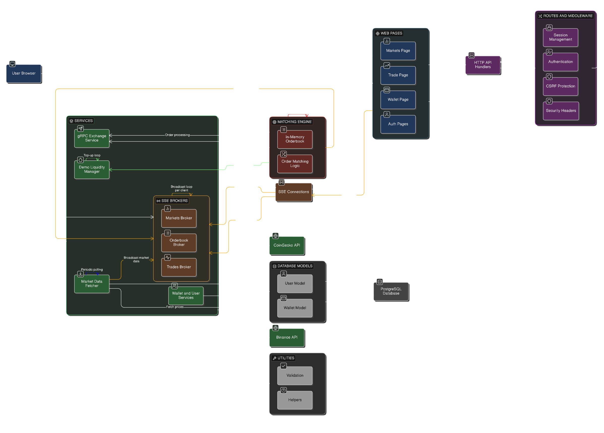

# Zaraba 

Zaraba is a high-performance cryptocurrency exchange backend built from the ground up in **Golang**. It focuses on technical excellence, using **gRPC** for internal communication and a custom **in-memory matching engine** for maximum throughput.

